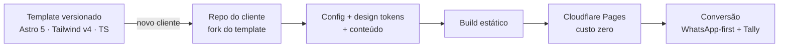

# Site Express — landing pages produtizadas, WhatsApp-first

> **Case study de arquitetura e produto.** O código do template é privado por ser a base de um produto comercial em operação. Este repositório documenta o problema, as decisões de engenharia e os trade-offs — que é o que importa para avaliar o trabalho.

**TL;DR** — Kit produtizado de landing pages para PMEs brasileiras de serviço: escopo fechado, preço fixo e entrega em dias. Astro 5 + Tailwind CSS v4 + TypeScript, arquitetura de seções componíveis com design tokens, formulários via Tally e deploy em Cloudflare Pages — **custo operacional zero** e conversão desenhada para onde o cliente brasileiro realmente fecha negócio: o WhatsApp.

## O problema

Pequenos negócios de serviço no Brasil — psicólogos, nutricionistas, personal trainers, clínicas — precisam de presença digital que gere cliente, mas o mercado só oferece dois extremos: site institucional caro e demorado, ou construtor genérico que não converte. E há um descompasso cultural: essas ferramentas empurram formulários de contato, enquanto o cliente brasileiro decide e agenda **conversando no WhatsApp**.

## A decisão de produto: produtizar

Em vez de vender "site sob medida" (escopo aberto, margem imprevisível), o Site Express é um **produto de escopo fechado**: seções pré-definidas de alta conversão, identidade visual aplicada por tokens, conteúdo do cliente e publicação. Isso muda a engenharia: o template precisa ser repetível, customizável sem retrabalho e ter custo marginal próximo de zero por cliente.

## Arquitetura

**Um repo por cliente, a partir de template versionado.** Cada cliente é um fork do template: isolamento total, customização livre quando necessária e nenhum risco de um cliente afetar outro. O trade-off aceito: melhorias do template não propagam automaticamente para sites já entregues — aceitável porque landing page entregue muda pouco, e mudanças estruturais são raras e cobráveis.

**Registro de seções componíveis.** A página é montada por composição a partir de um registro de seções ({{PREENCHER: seções reais do registro — ex.: hero, prova social, serviços, sobre, FAQ, CTA}}). Novo cliente = selecionar seções e preencher conteúdo, não escrever markup novo.

**Design tokens em CSS.** A identidade visual de cada cliente (cores, tipografia, raios, espaçamentos) vive em tokens — o tema muda sem tocar em componente. Tailwind v4 consome os tokens direto de CSS variables.

**Zero backend por decisão.** Formulários via Tally, conversa via WhatsApp com mensagem pré-preenchida, hospedagem estática no Cloudflare Pages. Sem servidor, sem banco, sem mensalidade de infraestrutura — e uma superfície de manutenção mínima.

## Decisões e trade-offs

**Astro em vez de Next.js.** Landing page não precisa de servidor nem de hidratação por padrão — Astro entrega HTML estático com zero JS onde não há interatividade, o que se traduz em Core Web Vitals excelentes de graça. Abro mão de features dinâmicas que este produto não usa.

**WhatsApp-first em vez de formulário-first.** O CTA primário abre uma conversa com mensagem pré-preenchida; o formulário (Tally) é secundário, para quem prefere não conversar de imediato. Decisão de conversão baseada no comportamento real do consumidor brasileiro de serviços locais.

**Tally em vez de formulário próprio.** Sem backend para receber submissões: menos código, menos custo, menos superfície de erro. O trade-off é depender de um terceiro — aceitável para o tíquete do produto, e substituível sem tocar no restante da arquitetura.

**Fork por cliente em vez de multi-tenant/CMS.** Um SaaS multi-tenant seria mais elegante — e mais caro, mais complexo e desnecessário para o volume-alvo. Complexidade é dívida: só se contrai quando o negócio pede.

## Performance e qualidade

Site estático, zero JS por padrão, imagens otimizadas no build e fontes com carregamento controlado. Acessibilidade básica de série: hierarquia semântica, contraste validado nos tokens e navegação por teclado.

## Engenharia assistida por IA

O template e o fluxo de entrega foram construídos com Claude Code no processo — especificação primeiro, geração revisada e padrões persistidos em diretrizes do agente. Front-end é o meu domínio de profundidade; aqui a IA acelera, e a revisão criteriosa continua sendo minha.

## Status

Produto em operação comercial.

---

*Case study por Leandro M. Silva — [leandromsilva.dev.br](https://www.leandromsilva.dev.br) · [LinkedIn](https://www.linkedin.com/in/leandromds) · [Corelix case study](https://github.com/leandromds/corelix-case-study)*
